# Comics Garden

Comics Garden is an ecommerce platform for an indie comic shop, the type of place you not only go to buy new comics, but also to find rare gems and connect with artists. Made with Django, Python, HTML, CSS (Bootsrap) and Javascript. (And also with a picture of my cat.)

The live project can be viewed [here](https://comics-garden-b0bf8a56b1c5.herokuapp.com/)

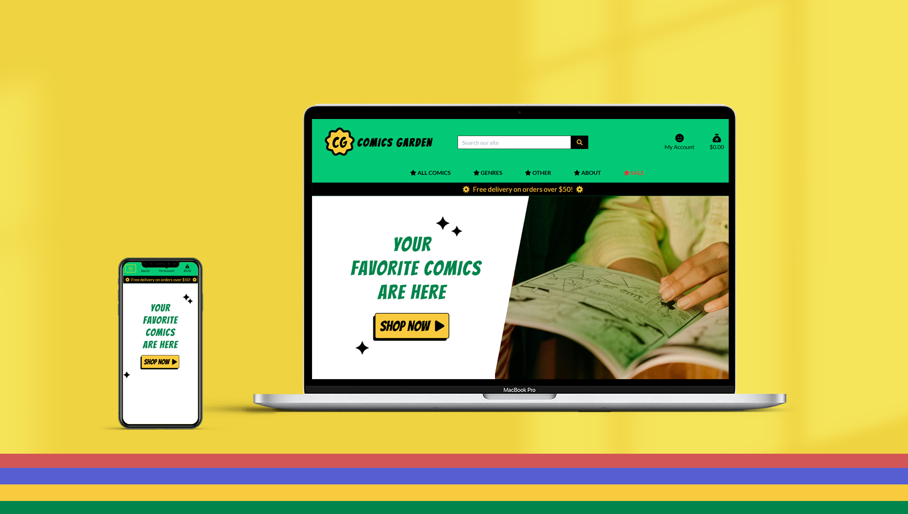

# Table of Contents

1. [ComicsGarden](#comicsgarden)
   - [Project Goal](#project-goal)
   - [Design](#design)
     - [Wireframe](#wireframe)
     - [Models](#models)
   - [User Stories](#user-stories)
   - [Flow](#flow)
   - [Special Features](#special-features)
     - [Auto-populate Genre List](#auto-populate-genre-list)
     - [Artist Page](#artist-page)
     - [Wishlist](#wishlist)
     - [Shop Management](#shop-management)
     - [Edit or Delete Products](#edit-or-delete-products)
     - [Relevant Book Details](#relevant-book-details)
   - [Business Model](#business-model)
     - [Customers](#customers)
     - [Value](#value)
     - [Keywords Research](#keywords-research)
     - [Marketing](#marketing)
   - [Testing](#testing)
     - [Responsiveness](#responsiveness)
     - [Lighthouse + Color Contrast](#lighthouse--color-contrast)
     - [Code Validation](#code-validation)
     - [Manual Testing](#manual-testing)
   - [Bugs](#bugs)
   - [Programs Used](#programs-used)
   - [Deployment](#deployment)
     - [Local Deployment](#local-deployment)
     - [Heroku](#heroku)
   - [Credits](#credits)
   - [Acknowledgements](#acknowledgements)


## Project Goal

For my eCommerce project, I decided to create an online shop for an indie comic store. What interests me about indie stores is their goal of creating spaces to sell items that are not often found elsewhere. When it comes to an indie comic shop, it’s a space that highlights artists and fosters marginalized creativity. My challenge was to reflect this in my project.

## Design

My first step was to think about the general design. After experimenting with a few ideas, I settled on a colorful, hippie, 90s nostalgia aesthetic. This style is making a comeback and is being embraced by many brands targeting younger audiences, such as Urban Outfitters and Lucy & Yak. It celebrates the positivity of supporting independent artists while remaining trendy.

Green was the main color for the project, connecting with the concept of a "garden" and fostering a sense of community, while bright yellow served as the secondary color.

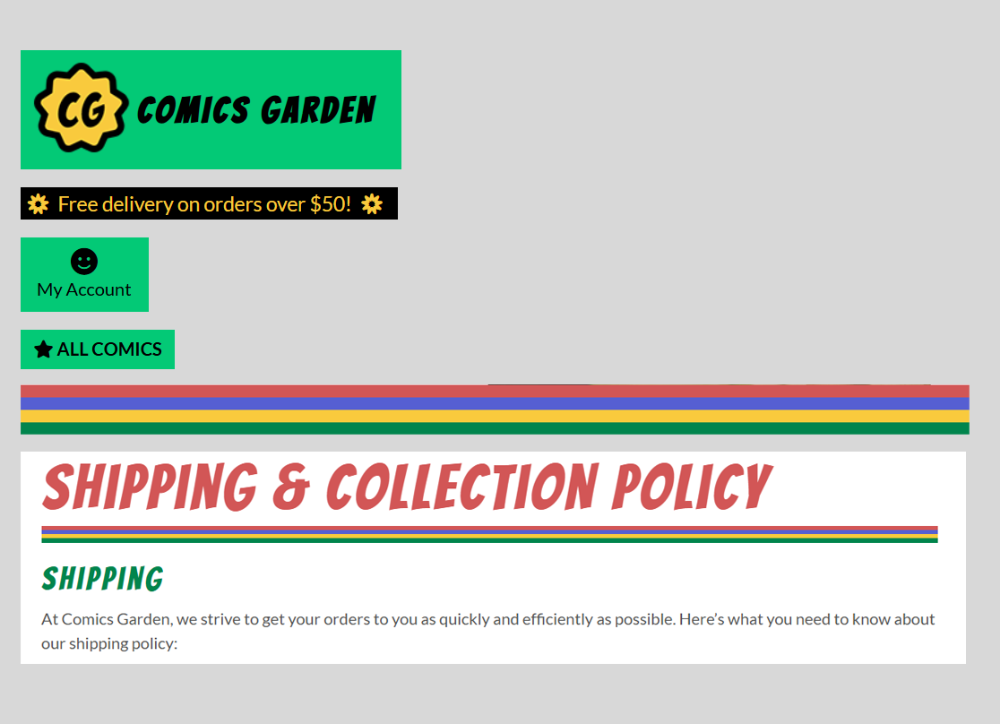

I incorporated elements like symbols, stars, and smiley faces throughout the project. To balance the two main colors, I added a rainbow stripe that functions as a standalone design element. This stripe is applied consistently across the project and could extend beyond it as branding elements for items such as packaging, shirts, bracelets, and bookmarks.

**Wireframe**

Throughout the project, I used Photoshop to organize and experiment with elements on the page before coding. The image below is quiet similar to the final result, but I created it first using Photoshop to have an idea of how I wanted to position elements and experiment with symbols, colors and fonts. 

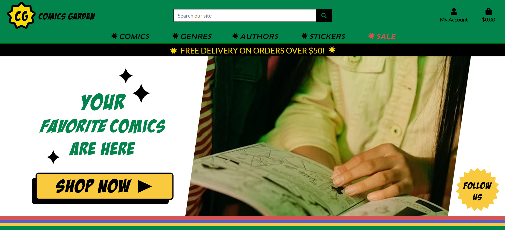

**Models**

I used Google Sheets to organize my ideas for models and the information I needed before starting the project.

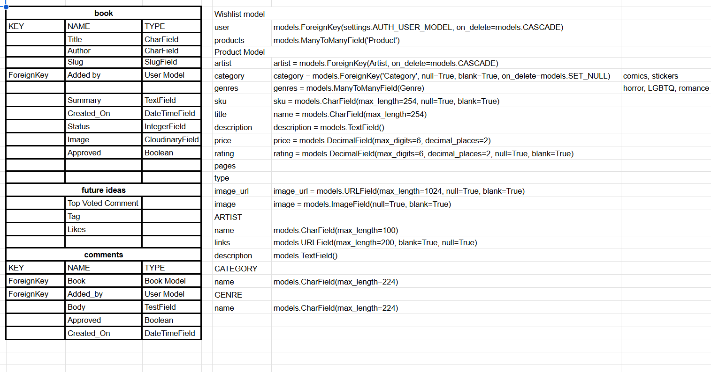

**User stories**

As a customer, I must be able to:

View products available
View specific categories
View book by genres
Filter prodcts
Search products
View individual products details
View information about artists
Quickly identify sales
View information about the shop
View shipping information
Easily view the total of my purchase
See social media links

Register for an account
Login and logout
Recover my password
Receive an email confirmation after registering
Have a personal user profile

Add books on my wishlist
View my wishlist
Delete my wishlist

Easily select the quantity of a product when purchasing it
View items in my bag to be purchased
Adjust the quantity of individual items in my bag
Easily enter my payment information
Feel my personal and payment information is safe and secure
View an order confirmation after checkout
Receive an email after checking out

As an admin, I must be able to:

Add a product
Add a genre
Add an artist
Add a publisher
Edit/Update a product
Delete a product

The board can be viewed on [Trello](https://trello.com/b/0qkopgt5)

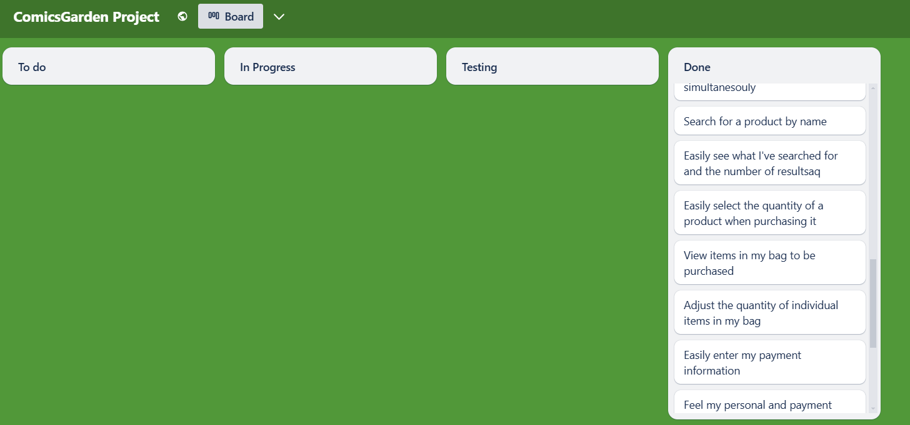

## Flow

Regarding the layout and user flow, I developed an approach I describe as “simple with highlights.” Comics Garden is a shop for a small business, so it should remain straightforward and accessible. At the same time, it includes design details that emphasize its purpose of showcasing alternative artists.

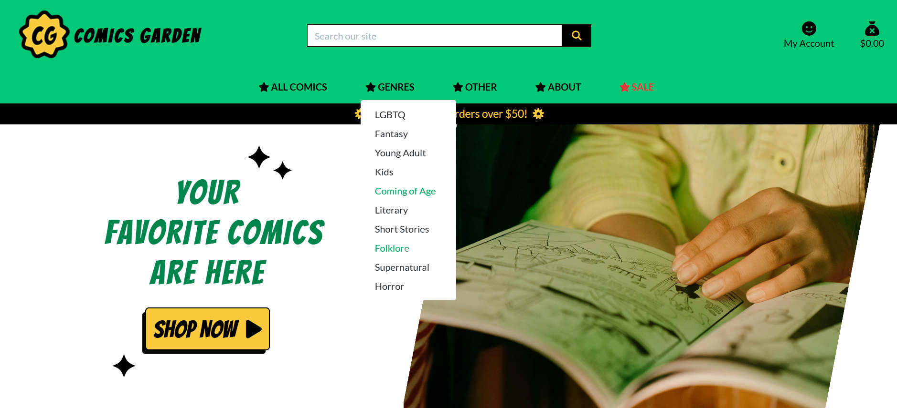

From the main page, the customer can browse books (and other products) in multiple ways. The can select "shop now" and go to a book list views, where they can find important details about the books such as title, author, price, category and genre tags. The customer can also use the navigation bar to browse products by category, genre or sale. 

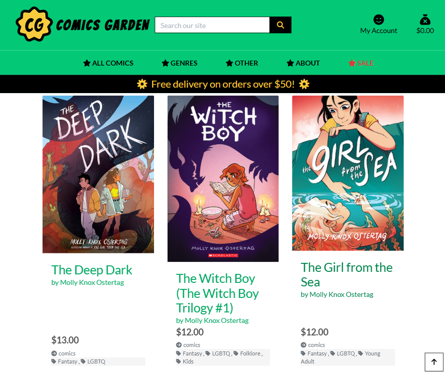

Besides that, from the main page the user can access everything they might need:

- The about page, where they can have more information about the shop.
- Login and registering. 
- Shopping bag.
- On the footer, they can find shipping information and social media links. 

After they logged in, they can also easily access their profile and wishlist. If the user is the admin, they can also access a Shop Management view.

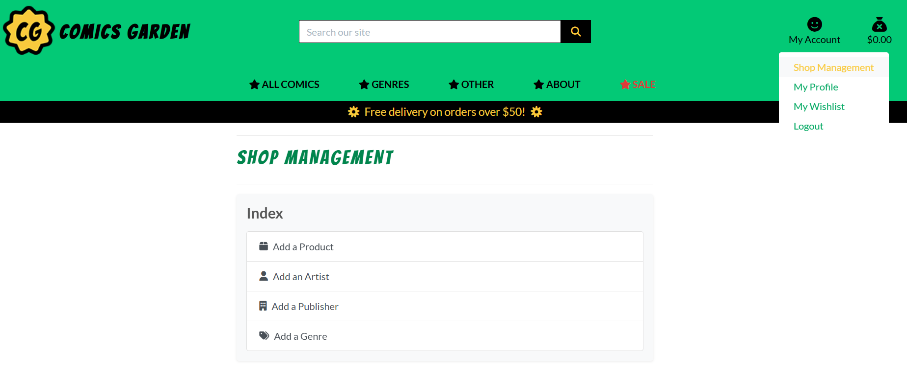

This is what I mean by straightfoward and accessible: Everything that the user needs is one click away from the main page.

## Special Features

Besides building a functional ecommerce platform, I included features made specifically thinking of the needs of indie comic shops users.

**Auto-populate genre list**

After researching indie comic shops, I noticed that their catalogues often include a wide range of book genres, some very specific. A menu with a full list of genres would be difficult to navigate and could create confusion. What’s the solution to this? I designed a menu that auto-populates based on the top 10 genres with the most books. For example, if the comic shop has more horror books, "Horror" will become one of its main genres, making it easily accessible to customers.

This approach ensures the menu remains relevant and requires low maintenance, which is ideal for a small business. This logic could also be applied to genres with bestselling books or those most searched by users. However, for the scope of this project, filtering by the genres with the most books made the most sense.

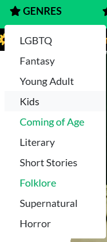

**Artist page**

I included a specific artist page that includes all their products available, a bio a link to social media. Many independent artists sell their products direct from indie comic shops, this way they can have a direct link to share on social media. It's like their small little shop indie the indie comic shop. At the same time, customers can browse artists that they like and find more of their work easily.

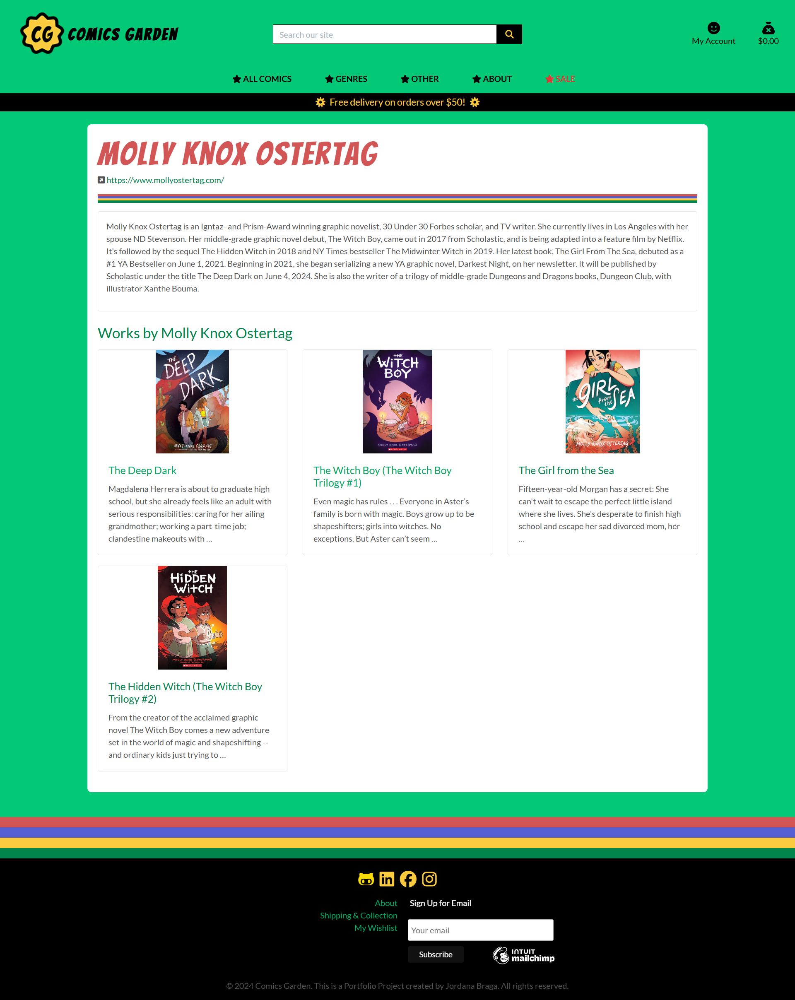

**Wishlist**

Since one of the goals of the shop is finding new books, a Wishlist system is a perfect feature. Users can wishlist books and see their list on a specific page. 

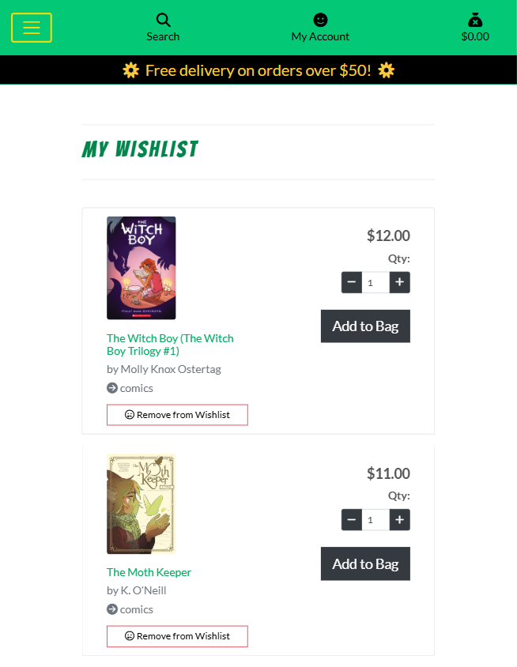

**Shop Management**

A page where the admin can quickly add new products, artists, publishers and genres to their catalogue. 

**Edit or Delete Products**

If the admin needs to edit quickly a product, they can do it directly after clicking "Edit" on a product page. 

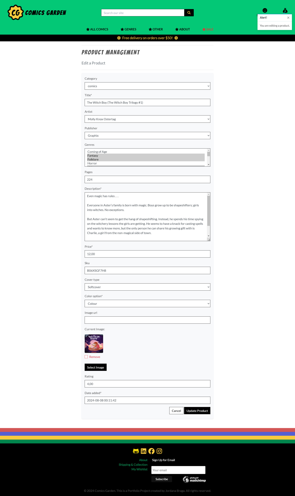

**Relevant book details**

While researching websites for indie comic shops, I noticed that they include specific information about books that are relevant for indie shop costumers, such as the number of pages, the type of cover (soft cover or hardcover) or if the comic book is in color or black and white. I also noticed that they often sell other products created by local artists, such as stickers and postcards, and I included these categories. 

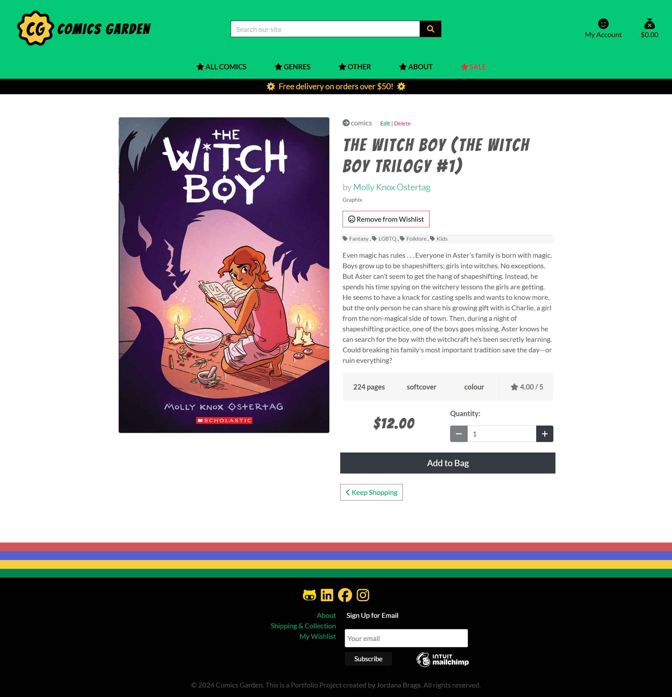

## Business model

Comics Garden is a comic shop that operates as a business-to-customer (B2C) retailer, sometimes acting as a bridge between local artists and their customers. It sells products through its comic shop in Dublin and online via an eCommerce platform. Currently, it only offers physical products. Payments are single and final, after which the product is delivered by a mail service.

**Customers**
Comic readers looking for diverse, independent, and rare comics while supporting local artists.

**Value**
Comics Garden simplifies the process of buying and discovering comics. The website features a clean design, multiple ways to search and browse books, a wishlist feature to save desired books, genre-based selection, and dedicated artist pages to help customers find more of what they like.

**Keywords research**

comics,
indie,
independent,
graphic novels,
indie comics,
artists,
illustrators,
irish comic artists,
local comic shops,
stickers,
postcards,
dublin comic shops,

**Marketing**
The website includes accessible social media links and a newsletter to enhance communication and digital presence. It is also optimized with SEO, a sitemap, and a robots.txt file.

I created for this project a [facebook page](https://www.facebook.com/profile.php?id=61570941802380)

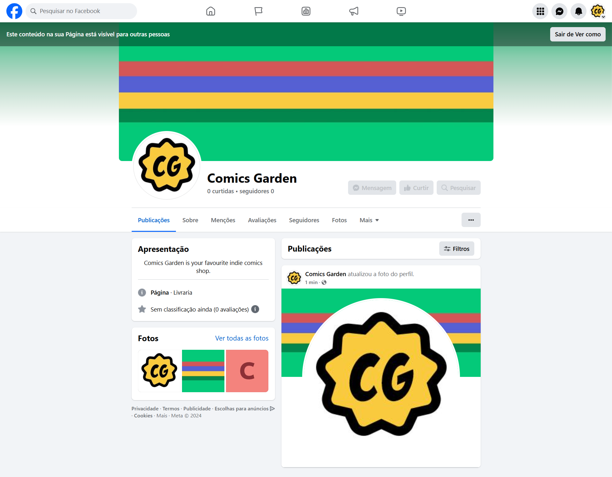

## Testing

### Responsiveness

While creating the project, I checked each feature and page to make sure it would work on different screen sizes. I used the Developer's Tool to do that, as while checking on desktop and mobile. 

### Lighthouse + Color Contrast

I also used Lighthouse to check for potential issues and then I used Siege Media color contrast to adjust colors. After checking Lighthouse, I included a label to the search button to improve accessibility as recommended, and I also included SEO keywords to the base.html. 

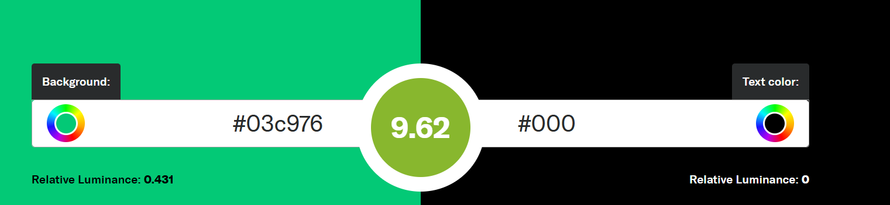

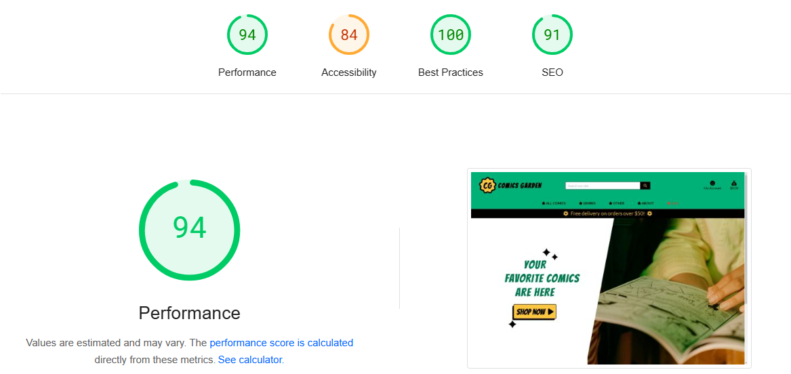

### Code Validation

#### Python code : 
- All python code is validated by both the Flake8 linter and the external Code Institute validator @ https://pep8ci.herokuapp.com/. I used Flake8 to scan general error and then paste the code on CI Python Linter to fix it. 

#### JavaScript code :
- The JavaScript code in the project was validated using JSHint. The error showed below was fixed. 

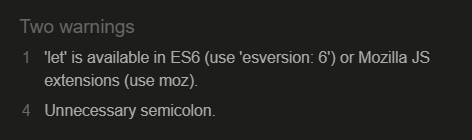

#### HTML Validation :
- All HTML files in the project were validated using the W3C Narkup Validation Service.
https://validator.w3.org/

#### CSS Validation :
- I pasted the entired CSS code from file style.css on the W3C Validation Service, and received the result "Congratulations! No Error Found."
https://jigsaw.w3.org/css-validator/

## Manual Testing

|Page|Feature|Action|Effect|
|---|---|---|---|
|Homepage|Site Logo|Click|Redirects to home page from all pages|
|Homepage|Logged In User Display|Log in as existing user|Account and Wishlist options appear|
|Homepage|Home link|Click|Redirects to home page from all pages|
|Homepage|ABOUT|Click|Redirects to about page|
|Homepage|Shipping page|Click|Redirects to shipping page|
|Homepage|Login link|Click|Redirects to Sign In Page|
|Homepage|Register link|Click|Redirects to Sign Up Page|
|Homepage|Book details|Click|Opens book page|
|Homepage|Social Media links|Click|All open new page with the correct social media link|
|Homepage|Navbar links|Click|Redirects to navbar links|
|Homepage|Logout link|Click|Redirects to confirm signout page|
|Homepage|Confirm logout|Click 'ok'|Redirects to home page|
|Homepage|Search bar|Type book name|Finds book|
|Homepage|Search bar|Type part of a word|Finds books|
|Homepage|Search bar|Type inexistent word "dsdas"|Shows message|
|Book list|Links|Click|All links lead to correct page or sorting|	
|Book list|Sorting|Select|Page sorts according to selection|
|Wishlist|Add to wishlist button|Click|Adds to the booklist and displays message|
|Wishlist|Delete from wishlist button|Click|Deletes from wishlist|
|Book page|Links|Click|All links lead to correct page or sorting|
|Book page|Buttons|Click|Increases or descreases the quantity, add to bag or wishlist|		
|Author page|Links|Click|All links lead to correct page or sorting|
|Checkout page|Buttons|Click|Concludes the order|
|Shop Management page|Content|Submit content|Add content to database|
|Edit book page|Content|Edit content|Edits content on database|

## BUGS

- When starting the project, the server wasn't running even after adding the url to allowed hosts. Solution: Closed everything and opened again. 
- When implementing search queries, it was giving an error related to icontains. Solution: I included in the search the artist's name, which is a foreign key. So the correct code is Q(artist__name__icontains=query)
- When implementing sorting queries, the sorting by specific genres wasn't working. Solution: Change code to case insensitive filter.
- Font Awesome links stopped working. Solution: Replacing the link in the base.html for a new one.
- When setting model fields to unique and trying to migrate, it gave an integrityError. Solution: It was due a duplicate item on the database. I used the admin panel to remove it, and tried to migrate again. It worked.
- When including link to the wishlist on the sucess message, the link would appear as plain text. Solution: Include the safe tag on toasts messages. 
- Search bar wasn't filtering books. Solution: I had to fix the product view.
- Card payments started failing and giving TypeError at /checkout/ unsupported operand type(s) for *: 'decimal.Decimal' and 'float'" error. Solution: When I was fixing long lines in python, the code broke.
- Order confirmation email wasn't arriving. Solution: Check webhooks on Stripe, there was an error with the payment intent. Stripe recently changed it on an update, I needed to import stripe to my webhook handler file and include this code:

stripe_charge = stripe.Charge.retrieve(
    intent.latest_charge
)

# Programs Used
1. [Gitpod](https://www.gitpod.io/)
    - I used all my available gitpod hours to finish this project, and a bit more provided by Code Institute.
2. [Heroku](https://www.heroku.com/)
    - Heroku was used to deploy the project terminal.
4. [Github](https://github.com/)
    - Github was used to store the projects after being pushed from Git and its cloud service [Github Pages](https://pages.github.com/) was used to serve the project on the web. GitHub Projects was used to track the User Stories, User Epics, bugs and other issues during the project.
8. Photoshop
    - I used Photoshop to create and edit assets fo the project.

# Deployment

## Local Deployment
You can clone this repository and run it locally with the following steps:
1. Login to GitHub (https://wwww.github.com)
2. Select the repository 
3. Click the Code button and copy the HTTPS url
4. In your IDE, open a terminal and run the git clone command, for example:
    ```git clone https://github.com/AlexGCbn/CI_PP5_StarDesk.git```
5. The repository will now be cloned in your workspace
6. Create an env.py file(This file should be included in .gitignore, so it will not be commited) in the root folder in your project, and add in the following code with the relevant key, value pairs, and ensure you enter the correct key values<br>
<code>import os</code>
<br><code>os.environ['SECRET_KEY'] = 'ADDED_BY_YOU'</code>
<br><code>os.environ['DATABASE_URL'] = 'ADDED_BY_YOU'</code>
<br><code>os.environ['STRIPE_PUBLIC_KEY'] = 'ADDED_BY_YOU'</code>
<br><code>os.environ['STRIPE_SECRET_KEY'] = 'ADDED_BY_YOU'</code>
<br><code>os.environ['STRIPE_WH_SECRET'] = 'ADDED_BY_YOU'</code>
<br><code>os.environ['DEVELOPMENT'] = 'ADDED_BY_YOU'</code>
<br><code>os.environ['EMAIL_HOST_PASS'] = 'ADDED_BY_YOU'</code>
<br><code>os.environ['EMAIL_HOST_USER'] = 'ADDED_BY_YOU'</code>
<br>

7. Install the relevant packages as per the requirements.txt file
8. In the settings.py ensure the connection is set to either the Heroku postgres database or the local sqllite database
9. Ensure debug is set to true in the settings.py file for local development
10. Add localhost/127.0.0.1 to the ALLOWED_HOSTS variable in settings.py
11. Run "python3 manage.py showmigrations" to check the status of the migrations
12. Run "python3 manage.py migrate" to migrate the database
13. Run "python3 manage.py createsuperuser" to create a super/admin user
14. Start the application by running <code>python3 manage.py runserver</code>
15. Open the application in a web browser with the URL: http://127.0.0.1:8000/

## Heroku
This project can be deployed to Heroku with the following steps:
1. Create an account on [Heroku](https://www.heroku.com/)
2. Create an app, give it a name for example stardesk, and select a region
3. Under resources search for postgres, and add a Postgres database to the app
4. Note the DATABASE_URL, this needs to be set as an environment variable in Heroku and your local environment variables
5. Create a Procfile with the text: web: gunicorn stardesk.wsgi
6. Make sure you add your environment variables (env.py) to Heroku's Config Vars
7. In the settings.py ensure the connection is to the Heroku postgres database
8. Ensure debug is set to false in the settings.py file
9. Add 'localhost/127.0.0.1', and 'stardesk.herokuapp.com' to the ALLOWED_HOSTS variable in settings.py
10. Run "python3 manage.py showmigrations" to check the status of the migrations
11. Run "python3 manage.py migrate" to migrate the database
12. Run "python3 manage.py createsuperuser" to create a super/admin user
13. Connect the app to GitHub, and enable automatic deploys from main

# Credits

I used Code Institute's Boutique Ado project as a reference.

I created logos, images and used my own pictures. As well as public images of books. 

  - Image from Pexels
https://www.pexels.com/photo/woman-in-green-button-up-shirt-holding-newspaper-4841964/

# Acknowledgements

I want to thank Code Institute, my brother, the tutors who helped me, and the nice people from Student Care!